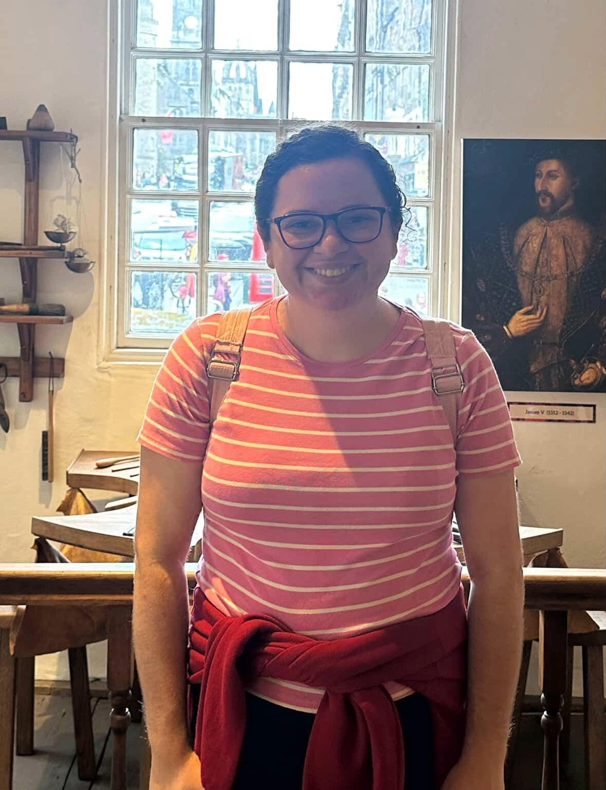

<!-- Top Navigation -->
<nav class="site-nav">
  <a href="/" class="https://github.com/tgrib/tgrib.github.io/blob/2091297bcbc01075eb37eec6df1e69fdbd088e13/about.md">About</a>
  <a href="/research/" class="nav-link">Research</a>
  <a href="/talks/" class="nav-link">Talks</a>
  <a href="/events/" class="nav-link">Events</a>
  <a href="/teaching/" class="nav-link">Teaching</a>
</nav>

  
  

    <h2>About</h2>
    
My name is Thais Gomes Ribeiro. I am a third-year <a href="https://www.birmingham.ac.uk/staff/profiles/maths/phd-students/gomes-ribeiro-thais">PhD student</a> in Pure Mathematics at the University of Birmingham, under the supervision of <a href="https://sites.google.com/view/tylerkelly/home">Professor Tyler Kelly</a>. 
        
My CV can be found <a href="https://drive.google.com/file/d/1wdPRrOpC1WuNck5YwdvwlXUy1Zwwog_N/view?usp=drive_link">here</a>. 
   
Contact me at <a href="mailto:txg306@student.bham.ac.uk">txg306@student.bham.ac.uk</a>. 
   
I am a Christian, Reformed Presbyterian. All my worldviews come from the Bible. I follow the <a href="https://thewestminsterstandard.org/the-westminster-standards/">Westminster Standards of Faith</a>. 
  
I am originally from Brazil.

  

