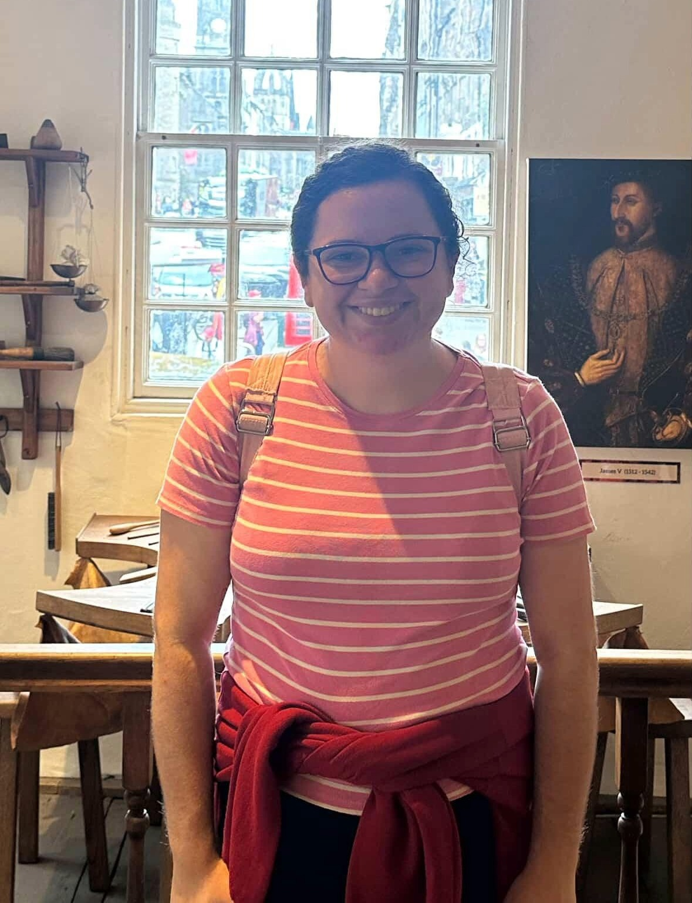

---
layout: default
title: Hello!
--- 

  
  

    <h2>Hello!</h2>
    
My name is Thais Gomes Ribeiro. I am a third-year <a href="https://www.birmingham.ac.uk/staff/profiles/maths/phd-students/gomes-ribeiro-thais">PhD student</a> in Pure Mathematics at the University of Birmingham, under the supervision of <a href="https://sites.google.com/view/tylerkelly/home">Professor Tyler Kelly</a>. My CV can be found <a href="https://drive.google.com/file/d/1wdPRrOpC1WuNck5YwdvwlXUy1Zwwog_N/view?usp=drive_link">here</a>. 
   
Contact me at <a href="mailto:txg306@student.bham.ac.uk">txg306@student.bham.ac.uk</a>. 
   
I am a Christian, Reformed Presbyterian. All my worldviews come from the Bible. I follow the <a href="https://thewestminsterstandard.org/the-westminster-standards/">Westminster Standards of Faith</a>. 
  
I am originally from Brazil.

   

  - [Research](/research/)
  - [Talks](/talks/)
  - [Events](/events/)
    
  

<h2> Research Interests </h2> 

Hypergeometric functions over finite fields, K3 surfaces, Picard-Fuchs equations, A-hypergeometric functions over finite fields, L-functions of K3 surfaces, A-hypergeometric systems and, more recently, also Taylor Varieties. 

<h2> Preprint </h2>

<a href="https://arxiv.org/abs/2508.15049">Hypergeometric decomposition of Delsarte K3 pencils </a> (with Rachel Davis, Jessamyn Dukes, Eli Orvis, Adriana Salerno, Leah Sturman, Ursula Whitcher), 44 pages. 

